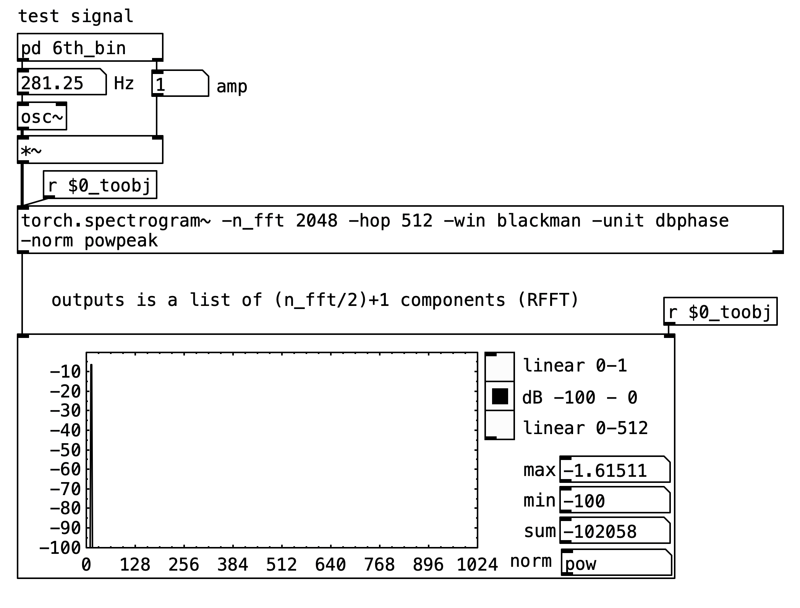
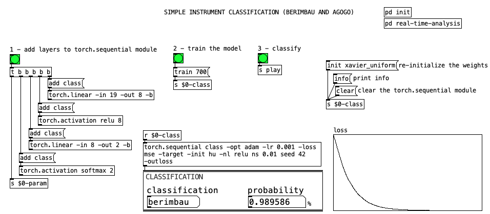

# conTorchionist:  a flexible nomadic library for exploring machine listening/learning in multiple platforms, languages, and time-contexts 

#### José Henrique PADOVANI (UFMG)
#### Vinícius Cesar de OLIVEIRA (UNICAMP)

    

### SBCM 2025, NICS/UNICAMP, Campinas/Brazil - September 17, 2025

---
## *machine listening*: contexts and meanings

   

  -  *machine listening* in *Interactive Music Systems*: initially, meaning to the process of 'listening to' MIDI parameters 
  - in MSP/PD context:  real-time audio feature extraction and analysis 
  - 2000s: increasingly influenced by the *machine listening* meaning from related fields like Music Information Retrieval (MIR), Automatic Speech Recognition (ASR), and Computational Auditory Scene Analysis (CASA) 
  - today, in a broader context: 
  strongly transformed by the widespread adoption of machine learning (ML)/artificial intelligence (AI)/deep learning (DL) techniques 
  - from a critical-exploratory-creative perspective: integration of these techniques into artistic and research practices is still challenging.

---

## challenges

- **pragmatic/end-user** design: many tools are designed for very specific purposes (e.g., stem separation, timbre transfer, etc.) but not for general exploration.
- **'black box'**: many modern tools function as opaque "black boxes", limiting creative exploration and understanding, segregating people into "users"  and "developers".
- **isolation** into environment/language, OS, architecture, and/or time-context: many tools are tied to a specific environment/language, OS, architecture or time-context, restricting workflows (e.g.: train in non-real-time, use/apply in real-time; usage of different tools in musicological and creative contexts; etc.).
- **CPU-only**: most tools do not leverage **GPU** acceleration, while this is widely used in other AI/ML fields.

---

## conTorchionist goals

- **flexibility**: allow for use the same machine listening/learning in different contexts (real-time/non-real-time; environments/languages; OS/architectures; CPU/GPU; etc)
- **nomadic**: allow for easy migration/integration of  workflows and models between different environments/languages (PD, Max, SC, Python, etc.)
- **transparent**: provide access/manipulation of the inner workings of the DSP/ML algorithms
- **torch-based**: take advantage of the open-source PyTorch/libtorch/torchaudio ecosystem, which is widely used in the AI/ML community
- **core/wrappers architecture**: a single C++ core shared library (relying on `libtorch`) with language-specific wrappers for different environments (PD, Max, SC, Python, etc.)

---
## remarkable and inspiring projects

-   **Librosa (Python):** The most popular Python library for Music Information Retrieval (MIR), offering a vast range of tools for audio analysis.
-   **Essentia (C++/Python):** A C++ library with Python bindings, prioritizing efficiency and scalability for both real-time and non-real-time processing.
- **timbreID (Pure Data), Zsa.Descriptors (Max), SCMIR (SuperCollider):** Real-time audio feature extraction libraries tailored to their respective environments.
- **FluCoMa (Fluid Corpus Manipulation):** A comprehensive C++ toolset for Max, Pure Data, and SuperCollider, enabling both real-time and non-real-time corpus-based workflows. **(a great inspiration for this work)**
- **nn_tilde:** A direct bridge for running pre-trained PyTorch models (inference) in real-time environments like Max and Pure Data (with a port for SC), demonstrating the demand for this specific integration.
- **PyTorch / libtorch / torchaudio:** The foundational ML ecosystem. It provides powerful tensor computation on CPU/GPU and the core C++ backend (`libtorch`) that makes **conTorchionist** possible.

---

## architecture overview

A simple, two-part structure:

- **core library (C++)**
    - Relying on `libtorch` (the C++ core of PyTorch).
    - Built as a shared library (`.dylib`, `.so`, `.dll`).
    - Contains all core algorithms (`Processors`) for audio analysis, ML, etc.
    - Platform-agnostic.

- **Wrappers**
    - Language-specific bindings for PD, Max, SC, and Python.
    - Use language-specific APIs, utilities, and auxiliary headers to interface with the core library.
    - Handles the instantiation and management of `Processors` in the target environment.

---

## core / processors

A set of modular tools for signal processing, designed for high performance and customizability.

Some implemented `Processors`:

- `RMSOverlapProcessor`: RMS with different windowing/interpolation options, using a circular buffer (actually also a processor) to handle overlapping frames.
- `RFFTProcessor` / `IRFFTProcessor`: Real and Inverse Fast Fourier Transform.
- `SpectrogramProcessor`: Real-time spectrogram computation.
- `MelSpectrogramProcessor`: Maps frequency to the Mel scale.
- `MFCCProcessor`: Extracts Mel-frequency cepstral coefficients.

---

## example 1: `torch.rfft~` and `torch.irfft~` in Pure Data

The RFFTProcessor and IRFFTProcessor exposed as the [torch.rfft~] and [torch.irfft~] objects, respectively. They allow for real-time, GPU-accelerated FFT analysis directly within the patching environment.

  

    
    
torch.rfft~ and torch.irfft~ / Pure Data

  

---

## example 2: `torch.spectrogram~` in Pure Data & Max

The SpectrogramProcessor is exposed as the [torch.spectrogram~] object. It allows for real-time, GPU-accelerated spectrogram analysis directly within the patching environment.

  

    
    
torch.spectrogram~ / Pure Data

  

  

    
    
torch.spectrogram~ / Max

  

---

## example 3: Mel spectrogram in Pure Data

The MelSpectrogramProcessor is exposed as the [torch.melspectrogram~] object. It allows for real-time, GPU-accelerated Mel spectrogram extraction directly within the patching environment.

---

## neural network processors

`conTorchionist` supports two main approaches for integrating neural networks:

 

- **Inference:** Load and run complex, pre-trained models (from Python/PyTorch) in real-time using the `[torch.ts~]` object.

 

- **Interactive Model Building:** Create, train, and explore simple neural networks directly within the environment (e.g., Pure Data) using modular objects/processors (`[torch.sequential]`, `[torch.linear]`, `[torch.activation]`, etc.).

---

## example 4: loading a pre-trained model

 

The [torch.ts] object can load a TorchScript model (`.ts`) to perform tasks like real-time audio synthesis or, in this case, MFCC frame reconstruction using an autoencoder.

<!--  -->

---

## example 5: building a network in pure data

The [torch.sequential] object acts as a container, allowing you to build a neural network layer by layer using other objects like [torch.linear] and [torch.activation]. This transforms the environment into an exploratory space for prototyping models.

---

## conclusion and future work

 

- development is at an early stage, with many features yet to be implemented (expand set of Processors, implement more wrappers, etc.) 
- the library is open-source (LGPLv3) and available at [https://github.com/ecrisufmg/contorchionist]
- binary releases to be made available when we have the current Processors wrappers implemented and documented

---

## final remarks / acknowledgments

- `conTorchionist` was made with the support of FAPEMIG, CAPES, and CNPq.
- AI agents and tools were used while sketching and writing some parts of `conTorchionist` (usually requiring a lot of corrections and adaptations)

---

## thanks!

 

code:
<a href="https://github.com/ecrisufmg/contorchionist">https://github.com/ecrisufmg/contorchionist</a>

 

examples:
<a href="https://www.youtube.com/watch?v=4R0uCS_r9QA">https://www.youtube.com/watch?v=4R0uCS_r9QA</a>

<a href="https://www.youtube.com/watch?v=0PbWdBhGKzk">https://www.youtube.com/watch?v=0PbWdBhGKzk</a>

<a href="https://www.youtube.com/watch?v=AbU6onIZAO8">https://www.youtube.com/watch?v=AbU6onIZAO8</a>

 

contact: 
<a href="mailto:jhp@ufmg.br">jhp@ufmg.br</a>
<a href="mailto:oviniciuscesar@gmail.com">oviniciuscesar@gmail.com</a>

